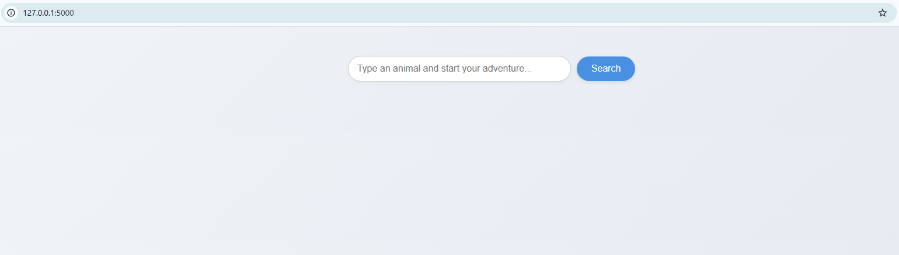

# Text-based Food Image Retrieval

This is a web application that allows you to search for food images using text descriptions. The application uses **CLIP (Contrastive Language–Image Pre-training)** to convert text and images into numerical vectors (embeddings) and then uses the Faiss library for fast similarity search to find the most relevant images.

## Technologies
- **CLIP**: A powerful AI model for understanding the relationship between text and images.
- **Faiss**: An efficient library for fast vector similarity search.
- **Flask:** A Python web framework for building the local server and web interface. 


## Installation
Before running the application, you'll need to install the required libraries. 

1. **Install Python:** Make sure you have Python 3.8 or a higher version installed.
2. **Create a virtual environment (recommended):** 
```
python -m venv venv
source venv/bin/activate  # On macOS/Linux
venv\Scripts\activate     # On Windows
```

3. **Install dependencies:** 
```
pip install -r requirements.txt
```

## Usage 
#### **Step 1: Create the Image Index**
Run the ```index.py``` script to process all images in the ```static/data/images/```directory. This script extracts image feature vectors and creates the ```index.faiss``` and ```image_paths.json files```, which are essential for the search functionality.

```
python index.py
```

In case, you want to change the directories of dataset. Let's adjust ```--image_dir_path``` argument. 

Once the script finishes, you will see the ```index.faiss``` and ```image_paths.json``` files created in the static/ directory.

#### **Step 2: Start the Web Server** 
After the index files are created, run the ```server.py``` script to start the local web server.

```
python server.py
```

Once the server is running, open your web browser and navigate to **http://127.0.0.1:5000**.

The screen of web demo looks like: 




## License

This project is licensed under the **MIT License** - see the [LICENSE](LICENSE) file for details.